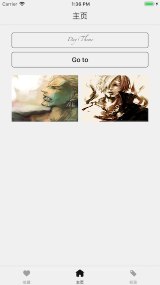
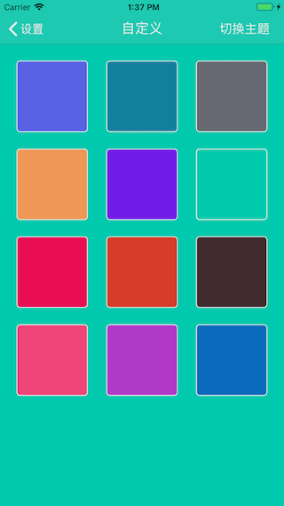
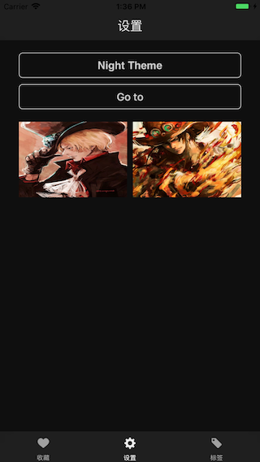

# QXTheme

[](https://travis-ci.org/Maoyis/QXTheme)
[](http://cocoapods.org/pods/QXTheme)
[](http://cocoapods.org/pods/QXTheme)
[](http://cocoapods.org/pods/QXTheme)

## Example

[DEMO](https://github.com/Maoyis/QXTheme)





## Requirements

* iOS 8.0+

主题文件目前只支持plist以及json文件

## Installation

QXTheme is available through [CocoaPods](http://cocoapods.org). To install
it, simply add the following line to your Podfile:

```ruby
pod 'QXTheme'
```


## Use
1. 初始配置一个默认主题（推荐在AppDelegate.h的 - (BOOL)application:application didFinishLaunchingWithOptions:方法中设置）
	
	dispatch_async(dispatch_get_main_queue(), ^{
        [QXThemeManager initDefaultThemeWithFileName:@"Theme_Day.plist"];
        [QXThemeManager refreshTheme];
    });
    

2. 控件定制主题方法：
	
	普通使用：
	
		[self.label qx_OrderPacks:^(QXThemeStaff *staff) {
	        staff.packing(@selector(setTextColor:), @[COLOR_ATTR(@"textColor1")]);
	        staff.packing(@selector(setFont:), @[FONT_ATTR(@"labelFont")]);
	        staff.packing(@selector(setBackgroundColor:), @[COLOR_ATTR(@"themeColor")]);
	        staff.packing(@selector(setText:), @[TEXT_ATTR(@"labelText")]);
	    }];
	    [self.label.layer qx_OrderPacks:^(QXThemeStaff *staff) {
	        staff.packing(@selector(setCornerRadius:), @[@6]);//偷下懒。这些也可以定制
	        staff.packing(@selector(setBorderWidth:), @[@1]);
	        staff.packing(@selector(setBorderColor:), @[COLOR_ATTR(@"textColor1")]);
	    }];
	    
	链式用法：
	 
		[self.navigationBar qx_OrderPacks:^(QXThemeStaff *staff) {
		staff.
		packing(@selector(setTranslucent:), @[OTHER_ATTR(@"nav_translucent")]).
		packing(@selector(setBarTintColor:), @[COLOR_ATTR(@"themeColor")]).
		packing(@selector(setTintColor:), @[COLOR_ATTR(@"tabbar_selectColor")]);
		    
		staff.packing(@selector(setTitleTextAttributes:),
		              @[@{NSFontAttributeName:FONT_ATTR(@"navTitle"),
		                  NSForegroundColorAttributeName:COLOR_ATTR(@"tabbar_selectColor")}]);
}];
	
	**PS:**定制属性需要通过**COLOR_ATTR、FONT_ATTR、TEXT_ATTR、IMAGE_ATTR、OTHER_ATTR**包装对应的主题颜色、字体、文本、图片，以及其他一些属性（如：是否透明，圆角，frame等）

3. 修改主题：
		
		//修改当前主题
		[QXThemeManager changeThemeWithTag:@"themeColor" value:hexStr tagType:QXThemeTagTypeOfColor];
		
4. 切换主题

		[QXThemeManager changeThemeWithFileName:@"新主题.json"];
5. 导出主题

            if (![[QXThemeManager shareManager].curTheme exportThemeFileWithFileType:QXThemeFileTypeJson name:@"ThemeName" path:@"myDesktop/QXTheme" error:&error]) {
            NSLog(@"导出失败Error:%@", error.localizedDescription);
            }

## Author

Maoyis, youaolanyi@foxmail.com

## License

QXTheme is available under the MIT license. See the LICENSE file for more info.
